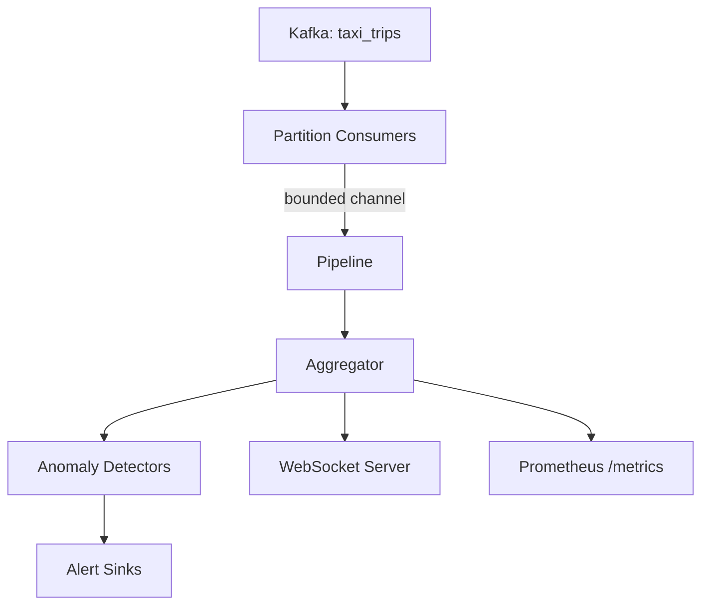

# stream-intel

A realtime stream intelligence service written in Go. Consumes taxi trip events from Kafka independently from Spark, providing low-latency operational analytics alongside the batch/lakehouse medallion architecture in [data-streaming-platform](https://github.com/dmcelhill/data-streaming-platform).


---

## What it does

- Consumes events from Kafka in real time (concurrent partition consumers)
- Aggregates per-zone statistics (trip count, average fare)
- Detects anomalies (fare spikes, inactive zones) on a configurable interval
- Exposes Prometheus metrics (`/metrics`) for operational monitoring
- Pushes live aggregation snapshots to connected WebSocket clients
- Supports replay (seek to earliest offset) triggered via WebSocket command


---

## Architecture



The service runs as an independent Kafka consumer group. It does not interfere with Spark's consumer — both read from the same topic via separate group IDs.


---

## Prerequisites

- Go 1.22+
- Access to the Kafka broker from `data-streaming-platform` (default: `localhost:9094`)
- Topic `taxi_trips` with events being produced


---

## Quick Start

```bash
# Enable pre-commit hooks
git config core.hooksPath .githooks

# Start the shared Kafka broker (from data-streaming-platform)
cd ../data-streaming-platform && make up

# Ensure topic exists
docker exec dsp-kafka rpk topic create taxi_trips

# Run the service
go run ./cmd/stream-intel

# Produce events (from data-streaming-platform)
cd ../data-streaming-platform && make produce
```


---

## Configuration

All configuration via environment variables:

| Variable | Default | Description |
|----------|---------|-------------|
| `KAFKA_BROKERS` | `localhost:9094` | Comma-separated broker addresses |
| `KAFKA_TOPIC` | `taxi_trips` | Topic to consume |
| `KAFKA_GROUP_ID` | `stream-intel` | Consumer group ID |
| `METRICS_PORT` | `9090` | Prometheus metrics HTTP port |
| `WS_PORT` | `8080` | WebSocket server port |
| `LOG_LEVEL` | `info` | Log level |
| `PIPELINE_BUFFER_SIZE` | `100` | Internal channel buffer size |
| `DETECTOR_INTERVAL_SECS` | `10` | How often detectors and broadcasts run |
| `FARE_SPIKE_THRESHOLD` | `50.0` | Average fare threshold for alerts |
| `DEAD_ZONE_THRESHOLD_SECS` | `300` | Seconds of inactivity before dead zone alert |


---

## Development

```bash
# Run tests
make test

# Build binary
make build

# Lint
make lint

# Run directly
make run
```


---

## Observability

- **Metrics**: `curl localhost:9090/metrics | grep stream_intel`
- **WebSocket**: connect to `ws://localhost:8080/ws` for live zone snapshots
- **Replay**: send `{"action": "replay"}` over the WebSocket to reprocess from the beginning
- **Alerts**: logged to stdout when fare spikes or dead zones are detected


---

## Key Dependencies

| Library | Purpose |
|---------|---------|
| [confluent-kafka-go](https://github.com/confluentinc/confluent-kafka-go) | Kafka consumer (librdkafka-based) |
| [prometheus/client_golang](https://github.com/prometheus/client_golang) | Metrics exposition |
| [gorilla/websocket](https://github.com/gorilla/websocket) | WebSocket connections |
| [slog](https://pkg.go.dev/log/slog) | Structured logging (stdlib) |


---

## Go Concepts Covered

This project is a hands-on exploration of Go through a realistic streaming workload:

- Goroutines and errgroup (concurrent partition consumers, managed lifecycle)
- Channels (bounded, directional, select, backpressure)
- Context propagation and cancellation (graceful shutdown)
- Pointers and pointer receivers (shared mutable state)
- Interfaces (pluggable detectors, sinks)
- sync.RWMutex (protecting aggregation state)
- HTTP server with graceful shutdown
- WebSocket fan-out pattern (hub, per-client goroutines)
- JSON marshalling/unmarshalling
- Error handling patterns (multi-return, wrapping, type assertions)
